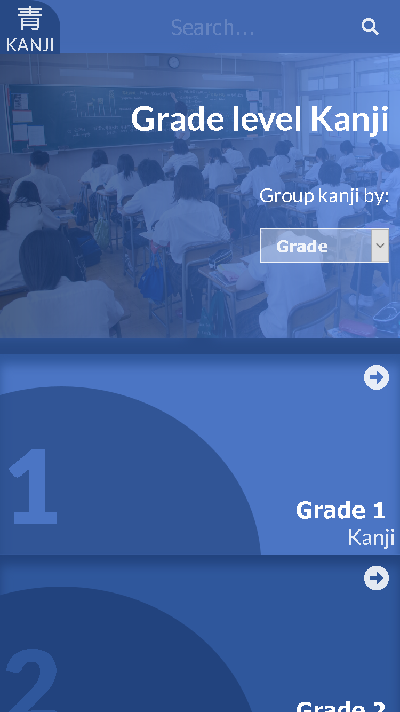
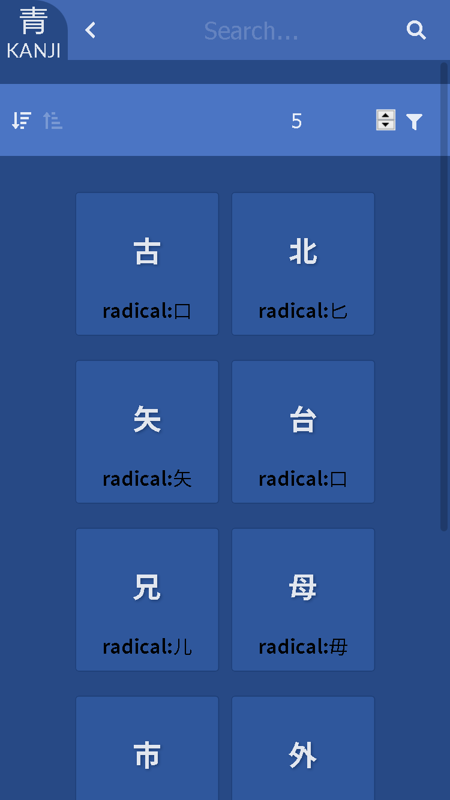
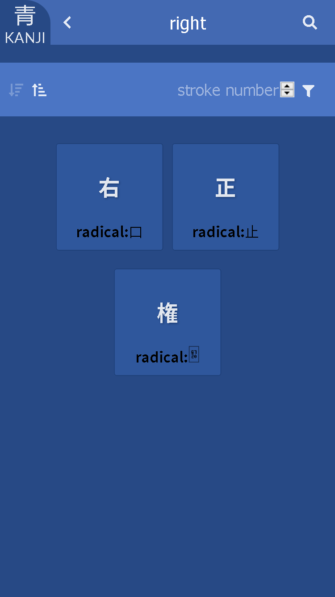
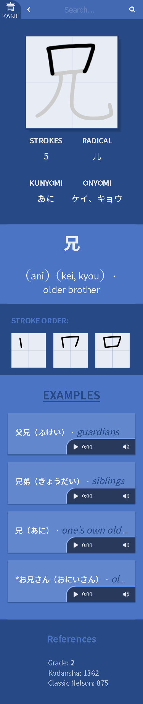

[![Contributors][contributors-shield]][contributors-url]
[![Forks][forks-shield]][forks-url]
[![Stargazers][stars-shield]][stars-url]
[![Issues][issues-shield]][issues-url]
[![LinkedIn][linkedin-shield]][linkedin-url]


<!-- PROJECT LOGO -->
<br />
<p align="center">
  <a href="https://uryelah.github.io/ao-kanji/">
    
  </a>

  <h1 align="center">
    <a href="https://uryelah.github.io/ao-kanji/">
    Ao Kanji
    </a>
  </h1>

  <p align="center">
    A simple one page kanji study webapp
    <br />
    <a href="https://uryelah.github.io/ao-kanji/"><strong>Use it live here »</strong></a>
    <br />
    <br />
    <a href="https://github.com/uryelah/ao-kanji/issues">Report Bug</a>
    ·
    <a href="https://github.com/uryelah/ao-kanji/issues">Request Feature</a>
  </p>
</p>

<!-- TABLE OF CONTENTS -->
## Table of Contents

* [About](#about)
* [About the App](#about-the-app)
* [Navigation](#navigation)
* [Characters](#characters)
* [Views](#views)
* [Routes](#routes)
* [Prerequisites](#prerequisites)
* [Built With](#built-with)
* [Commands](#available-commands)
* [Contact](#contact)
* [Acknowledgements](#acknowledgements)
* [CopyRight/Attributions](#copyRight/Attributions)


## About

This project was built as the React capstone for the Microverse curriculum.

It consists of a single page application with client side routing, API consumption and state managed by redux.

This project requires no authentication, it's a catalogue, with filter, sorting and details features.

To read the full project requirements visit [this link](https://www.notion.so/Catalogue-of-Statistics-72446e7fa33c403a9b6a0bc1de5c6cf5).

Repository: https://github.com/uryelah/ao-kanji

## About The App

**Ao Kanji** consists of a single page web app for browsing, searching and studying Japanese Kanji.

>Kanji (漢字, pronounced [kaɲdʑi] (About this soundlisten)) are the adopted logographic Chinese characters that are used in the Japanese writing system. They are used alongside the Japanese syllabic scripts hiragana and katakana.

_[From wikipedia](Kanji)_

For this project I chose a free API that serves kanji lists and details, including examples of usage and pronunciation, in the app it's possible to browse a pre-defined list of kanjis or do you own search based on a latin alphabeth word.

**Features**

- Loading visual feedback between data fetch requests

- Fetching kanji lists from different API endpoints

- "Back" button at the navbar to browse through past searches

- Mobile first design

- Animate examples for the kanji stroke order

- Audio examples for kanji pronunciation

- Kun and On readings

- Kanji english translation

- Centralised state for fetched kanji data

- Centralised state for kanji list sorting and filtering

- Unique client side routes

- Use of react hooks

- Use of CSS modules and BEM

-----

## Navigation

[![Product Name Screen Shot][product-screenshot]](https://uryelah.github.io/ao-kanji/)

1. Select how you want to group the kanji lists

2. Click in a kanji list by grade or chapter

3. Filter the kanji by stroke order

4. Sort the kanji list

5. Select one of the kanji in the list

6. Read the details, reading, stroke order, examples, of the chosen kanji

7. Use the navigation bar to go back

8. Use the search bar to look for a kanji linked to a word of your chosing

9. Keeping browsing and learning

## Views

This app includes 4 different view:

- Landing page
<br/>


- Kanji list page
<br/>


- Kanji search page
<br/>


- Kanji details page
<br/>


-------

## Routes

| Route | Description |
|---------|-------------|
| `/` | Root route, you can select a kanji list from here |
| `/grade/:<NUMBER>` | List route, you can select kanji lists by grade level here |
| `/chapter/:<NUMBER>` | List route, you can select kanji lists by Macquarie chapters here |
| `/ap-chapter/:<NUMBER>` | List route, you can select kanji lists by AP chapters here |
| `/search/:<STRING>` | Search route, you can select kanji fitting the query string
| `/kanjis/:<KANJI>` | Details route, you can see information about a specific kanji here

-------

## Prerequisites

If you want to...

**View this app online**

Simply access [this link](https://uryelah.github.io/ao-kanji/) and enjoy the game!

**Run it locally**

1. Make sure you have [node installed](https://nodejs.org/en/download/) in you local environment.

2. Download or clone this repository

3. Navigate to the game root directory in your terminal

4. Install the required packages:
```sh
npm i
```
5. Start the game in your browser:
```sh
npm run start
```

------

### Built With
This project was built using the React SPA framework, consuming the data from the [Learn to read and write Japanese kanji API](https://rapidapi.com/KanjiAlive/api/learn-to-read-and-write-japanese-kanji/endpoints), together with Redux for state management.

* [React](https://reactjs.org/)
* [Redux](https://redux.js.org/)
* [Javascript](https://developer.mozilla.org/en-US/docs/Web/javascript)
* [Redux-thunk](https://github.com/reduxjs/redux-thunk)
* [Learn to read and write Japanese kanji API](https://rapidapi.com/KanjiAlive/api/learn-to-read-and-write-japanese-kanji/endpoints)
* [Webpack](https://webpack.js.org/)
* [Babel](https://babeljs.io/)


## Available Commands

| Command | Description |
|---------|-------------|
| `npm install` | Install project dependencies |
| `npm start` | Build project and open web server running project |
| `npm eject` | Eject configuration files for customization
| `npm run build` | Builds code bundle with production settings (minification, uglification, etc..) |
| `npm run test` | Run the available tests |
| `npm run predeploy` | Build code for deployment |
| `npm run deploy` | Pushes built code to gh-pages |

-------

## Contact

Sarah Chamorro - [@your_twitter](https://twitter.com/sarah_chamorro) - sarahchamorro@gmail.com

Project Link: [https://github.com/your_username/repo_name](https://github.com/your_username/repo_name)

-------

## Acknowledgements
* [StackOverflow](stackoverflow.com/)
* [Create React App](https://github.com/facebook/create-react-app)
* Microverse
* Team 54

## CopyRight/Attributions

This project was only possible thanks to the cretors bellow:

[Design idea by Nelson Sakwa on Behance](https://www.behance.net/gallery/31579789/Ballhead-App-(Free-PSDs))

[Kanji Alive great free kanji API](https://rapidapi.com/user/KanjiAlive)

-------

[contributors-shield]: https://img.shields.io/github/contributors/othneildrew/Best-README-Template.svg?style=flat-square
[contributors-url]: https://github.com/uryelah/ao-kanji/graphs/contributors
[forks-shield]: https://img.shields.io/github/forks/othneildrew/Best-README-Template.svg?style=flat-square
[forks-url]: https://github.com/uryelah/ao-kanji/network/members
[stars-shield]: https://img.shields.io/github/stars/othneildrew/Best-README-Template.svg?style=flat-square
[stars-url]: https://github.com/uryelah/ao-kanji/stargazers
[issues-shield]: https://img.shields.io/github/issues/othneildrew/Best-README-Template.svg?style=flat-square
[issues-url]: https://github.com/uryelah/ao-kanji/issues
[license-shield]: https://img.shields.io/github/license/othneildrew/Best-README-Template.svg?style=flat-square
[license-url]: https://github.com/uryelah/ao-kanji/blob/master/LICENSE.txt
[linkedin-shield]: https://img.shields.io/badge/-LinkedIn-black.svg?style=flat-square&logo=linkedin&colorB=555
[linkedin-url]: https://www.linkedin.com/in/uryelah/
[product-screenshot]: ./public/aokanji.gif
